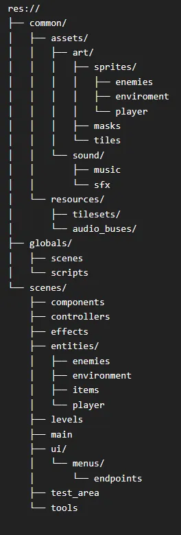

# Godot Game Jam Template

This repository serves as a starting point for game jam projects using Godot. It contains basic menu functionality and an established file structure to get you started quickly.

## Table of Contents
- [Features](#features)
- [File Structure](#file-structure)
- [Setup](#setup)
- [Usage](#usage)
- [Contributing](#contributing)
- [License](#license)

## Features
- Basic main menu with functionality to start the game or exit.
- Pre-configured file structure for quick development.
- Easily customizable for different game jam themes and styles.

## File Structure

Below is a suggested example file structure (which is currently used for the menus).

## Setup

1. Clone this repository to your local machine.
2. Open the project in Godot Engine:
- Make sure you have [Godot Engine](https://godotengine.org/download) installed.
- Open `project.godot` in Godot to start working on your game.

## Usage

- The repository includes a basic main menu / set of menu loops.
- You can modify these within the `scenes/ui/menus` directory.
- A main scene and script are already established to start prototyping out of.
- Some basic options like volume sliders and full screen are also preconfigured.
- For code consistency you can enable pre_commit linting / formatting if you are interested.
    - See [pre_commit](https://pre-commit.com/)
    - See [gdtoolkit](https://github.com/Scony/godot-gdscript-toolkit/tree/master)
- In main.gd there is a signal to call the game over screen, which can be modified / moved as needed.
    - *sig_game_over*

## Contributing

Feel free to fork this project and contribute to it. You can create pull requests for improvements, bug fixes, or suggestions.

1. Fork the repository.
2. Create a new branch (`git checkout -b feature-branch`).
3. Make your changes and commit them (`git commit -am 'Add feature'`).
4. Push to your branch (`git push origin feature-branch`).
5. Create a pull request.

## License

This project is licensed under the MIT License - see the [LICENSE](LICENSE) file for details